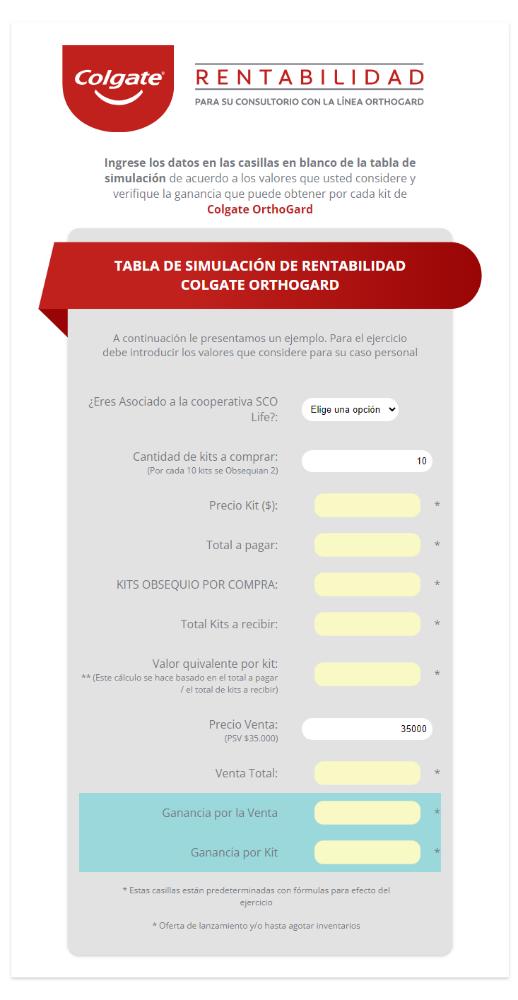

# README

¡Bienvenido al repositorio de la Tabla de Rentabilidad Colgate OrthoGard!

## Imagen ilustrativa

## Descripción

Esta aplicación es una herramienta web construida con HTML, CSS y JavaScript. Proporciona una tabla interactiva para realizar cálculos y análisis relacionados con Orthogard. Puedes acceder a la aplicación desplegada [aquí](https://tablaorthogardcol.kagencia.com/).

## Funcionalidades

- **Tabla Interactiva**: Utiliza la tabla para ingresar datos y realizar cálculos de manera intuitiva.
- **Análisis de Datos**: Realiza análisis y operaciones sobre los datos ingresados.
- **Compatibilidad Multiplataforma**: La aplicación está diseñada para funcionar en diferentes dispositivos y navegadores.

## Instrucciones de Uso

1. Accede a la [aplicación desplegada](https://tablaorthogardcol.kagencia.com/).
2. Ingresa los datos en la tabla según tus necesidades.
3. Utiliza las funciones y herramientas proporcionadas para realizar análisis y cálculos.
4. Explora las opciones de personalización y ajustes disponibles.

## Contribuciones

Si deseas contribuir al desarrollo de esta aplicación, ¡te animamos a hacerlo! Puedes seguir estos pasos:

1. Haz un *fork* del repositorio.
2. Clona tu *fork* a tu máquina local.
3. Crea una rama para tus cambios (`git checkout -b feature/nueva-funcionalidad`).
4. Realiza tus cambios y haz *commit* (`git commit -m 'Añade nueva funcionalidad'`).
5. Sube tus cambios a tu repositorio en GitHub (`git push origin feature/nueva-funcionalidad`).
6. Crea un *pull request* desde tu rama a la rama principal del repositorio original.

## Problemas y Sugerencias

Si encuentras algún problema o tienes sugerencias para mejorar la aplicación, por favor abre un *issue* en el [rastreador de problemas](https://github.com/tuusuario/turepositorio/issues).

¡Gracias por contribuir!

## Licencia

Este proyecto está bajo la Licencia MIT. Consulta el archivo [LICENSE](LICENSE) para obtener más detalles.

---

Esperamos que disfrutes utilizando la aplicación. ¡Gracias por tu interés y apoyo!
